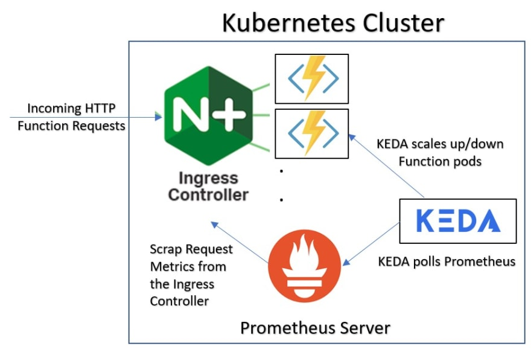

# k8s-autoscale-demo

Kubernetes Autoscaling Demo

***Reference: From Nginx Microservices March 2022: Kubernetes Networking***

## Tools/Components Involved

- Minikube - K8s Utility
- Kubectl - K8s CLI
- Deployment - K8s Component
- Helm (Package Manager) - Open Source
- Ingress rules and Ingress Controller (Nginx Ingress Controller) - Open Source
- Locust - Open Source
- Prometheus - Open Source
- Horizontal Pod Autoscaling (HPA) - K8s Component
- Kubernetes Event-Driven Autoscaler (KEDA) - Open Source

## Demo Summary

1. Create single K8s cluster locally using minikube
2. Exposing the app to external via Nginx Ingress Controller
3. Setup Prometheus server to collect metrics
4. Run load testing using Locust
5. Implement KEDA to store and expose the metrics from Prometheus server to HPA
6. HPA will do the scaling out of Nginx Ingress Controller to handle to high traffic volumes

## Demo

### 1. Create the Cluster

``` minikube start ```

### 2. Install the App

- Create a Deployment (deployment-1.yaml)
- Deploy PodInfo App

``` kubectl apply -f deployment-1.yaml ```

- Confirm App Deployment

``` kubectl get pods ```

### 3. Install Nginx Ingress Controller using Helm

``` helm repo add nginx-stable https://helm.nginx.com/stable ```

```

  helm install main nginx-stable/nginx-ingress \
  --set controller.watchIngressWithoutClass=true
  --set controller.service.type=NodePort \
  --set controller.service.httpPort.nodePort=30005 

```

- Verify Nginx Ingress Controller is running

``` kubectl get pods ```

### 4. Route Traffic to your App

- Create an Ingress Manifest (ingress-1.yaml)
- Submit the ingress manifest

``` kubectl apply -f 2-ingress.yaml ```

### 5. Explore Metrics

- Explore Available Metrics <https://github.com/nginxinc/nginx-prometheus-exporter#exported-metrics> 

| Name                         | Type    | Description                           |
| :---                         | :---:   | :---                                  |
|`nginx_connections_accepted`  | Counter | Accepted client connections           |
|`nginx_connections_active`    | Gauge   | Active client connections             |
|`nginx_connections_handled`   | Counter | Handled client connections            |
|`nginx_connections_reading`   | Gauge   | Connections where NGINX is reading the request header |
|`nginx_connections_waiting`   | Gauge   | Idle client connections               |
|`nginx_connections_writing`   | Gauge   | Connections where NGINX is writing the response back to the client |
|`nginx_http_requests_total`   | Counter | Total http requests                   |

- Find IP Address of the Nginx Ingress Controller Pod

``` kubectl get pods -o wide ```

- Create a Temporary Pod

``` kubectl run -ti --rm=true busybox --image=busybox ```

- Retrieve a list of available metrics

``` wget -qO- 172.17.0.4:9113/metrics ```

### 6. Install Prometheus

``` helm repo add prometheus-community https://prometheus-community.github.io/helm-charts ```

```

  helm install prometheus prometheus-community/prometheus \
  --set server.service.type=NodePort --set server.service.nodePort=30010

```

- Verify Prometheus is installed

``` kubectl get pods ```

- Go to Prometheus server and query Prometheus for `nginx_ingress_nginx_connections_active` metrics

### 7. Install Locust

- Create then apply yaml file (locust-1.yaml)

``` kubectl apply -f 1-locust.yaml ```

- Use locust to scale traffic

> Host: <http://main-nginx-ingress>

- View Prometheus to see how ingress controller responds

### 8. Install KEDA

- Add Repo and Install KEDA

``` helm repo add kedacore https://kedacore.github.io/charts ```

``` helm install keda kedacore/keda ```

- Verify KEDA

``` kubectl get pods ```

### 9. Configure Autoscaling

- Create and submit yaml file to define how Nginx Ingress Controller will scale using KEDA object (scaled-object-1.yaml)

``` kubectl apply -f scaled-object-1.yaml ```

### 10. Test Autoscaling

- Use locust to generate traffic
- View active connections in Prometheus
- Observe autoscaling
- Inspect KEDA HPA

``` kubectl get hpa ```

## Reference

